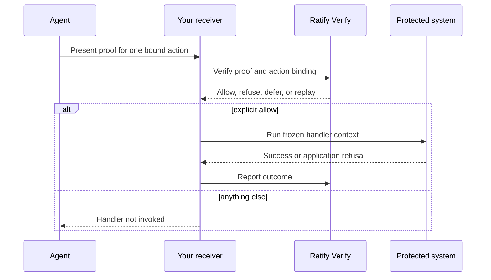

# Ratify receiver helper for TypeScript

[](https://github.com/identities-ai/ratify-receiver/actions/workflows/ci.yml)

The receiver helper is a small, server-side TypeScript package for protecting
consequential application actions with [Ratify Verify](https://ratifyprotocol.com/).
It asks Verify to decide whether an agent may perform one specific action, and
it only calls your handler after an explicit allow. Refusals, deferred decisions,
malformed responses, and replayed decisions do not reach the handler by default.

This package is for the receiving side of an agent workflow. It is not an agent
SDK, a key-management system, or a replacement for the open [Ratify Protocol](https://github.com/identities-ai/ratify-protocol).
Use the protocol SDKs when you issue delegations, sign presentations, or verify
offline. Use this helper when your TypeScript service receives an agent proof
and needs a safe application boundary before doing consequential work.

## Why this exists

The dangerous integration is easy to write: call a verification endpoint, then
remember to branch on the result before deploying, sending, changing, or
publishing something. The branch can be forgotten, bypassed on a new code path,
or run against mutable input that is no longer the input that was authorized.

This helper makes the safe path the API shape. It binds the action, snapshots and
freezes the JSON payload, captures the request context, and owns the decision to
invoke the handler. The handler receives the exact frozen values that were
authorized. Outcome reporting records whether the handler executed, refused, or
failed, while preserving the distinction between a Ratify decision and your
application's work.



## 60-second quick start

Requirements: Node.js 22 or newer, a Ratify Verify receiver integration with an
API key, and an agent proof produced for the same action and invocation ID.

The package is release-ready but is not published to npm yet. Until the first
release, clone the repository and install the package workspace locally:

```bash
git clone https://github.com/identities-ai/ratify-receiver.git
cd ratify-receiver
npm ci
```

After publication, the install command will be:

```bash
npm install @identities-ai/ratify-receiver
```

Releases are made by pushing a semantic version tag such as `v0.1.0`. CI runs
the full test suite and build again, then publishes the package with npm
provenance. The repository must have an `NPM_TOKEN` secret before the first
release.

```ts
import { RatifyReceiver } from "@identities-ai/ratify-receiver";

const receiver = new RatifyReceiver({
  apiKey: process.env.RATIFY_API_KEY!,
  verifierId: "receiver:acme-deployments",
  workspaceId: process.env.RATIFY_WORKSPACE_ID!,
});

const action = {
  action: "github.deploy",
  requiredScope: "custom:github:deploy",
  resourceId: `github:${owner}/${repo}`,
  requestedPath: `/services/${service}/environments/${environment}`,
  payload: { artifact_digest: digest },
  agentId: expectedAgentId,
  sessionId,
  invocationId,
};

const { challenge, sessionContext } = await receiver.challenge(action);
// Give challenge and sessionContext to the agent. It returns a proof.
const result = await receiver.guard(action, proof, async ({ action, payload, invocationId }) => {
  return deploy(action.resourceId, payload, { idempotencyKey: invocationId });
});

if (result.status === "replayed") {
  // Reconcile with the downstream idempotency key, or issue a new invocationId.
}
```

The helper is intentionally TypeScript and Node.js only. This package is an
ergonomic receiver integration, not the Ratify wire protocol itself. TypeScript
gives JavaScript services strict types and declarations without creating a
second protocol implementation. The protocol remains language-neutral and has
SDKs and references for other runtimes. A Python, Go, or Rust service should use
the corresponding protocol or Verify integration rather than pretending this
Node package is portable across runtimes.

## Ratify layers

| Layer | Use it for | Link |
| --- | --- | --- |
| Ratify Protocol | Open delegation, presentation, and verification primitives | [Protocol repository](https://github.com/identities-ai/ratify-protocol) |
| This receiver helper | TypeScript server boundary before a protected handler runs | This package |
| Ratify Verify | Managed verification, revocation, policy, receipts, and audit | [Ratify Verify](https://ratifyprotocol.com/) |

The helper does not make an action safe by itself. Your handler must use the
frozen `context.action` and `context.payload`, and downstream systems should use
`invocationId` as an idempotency key. Read [Retries](#retries) before enabling
`onReplay: "run"`.

## API reference

Everything exported from `@identities-ai/ratify-receiver`. Anything not listed
here is internal and may change without a major version.

### `RatifyReceiver`

| Member | Signature | Notes |
|---|---|---|
| `constructor` | `(config: ReceiverConfig)` | `apiKey`, `verifierId` and `workspaceId` are captured here and never re-read, so a later change to the config object cannot alter what a request carries. |
| `challenge` | `(action) => Promise<{ challenge, sessionContext }>` | The challenge and the context the agent signs it over. |
| `guard` | `(action, proofBundle, handler, options?) => Promise<GuardResult>` | Decides, then runs `handler` only on an allow that has not already been given. |
| `decide` | `(action, proofBundle) => Promise<DecisionResult>` | The same decision, running nothing. You own the branch, including replay handling. |
| `reportOutcome` | `(invocationId, receiptId, outcome, detail?) => Promise<Error \| undefined>` | Never throws; returns a reporting failure rather than discarding it. |

### Types

| Type | What it is |
|---|---|
| `ReceiverConfig` | `apiKey`, `verifierId`, `workspaceId`, optional `baseUrl` and `fetch`. |
| `ProtectedAction` | One consequential action: `action`, `requiredScope`, `resourceId`, optional `requestedPath`, optional `payload`, `agentId`, `sessionId`, `invocationId`, optional `actionProfile`. |
| `GuardOptions` | `onReplay?: "skip" \| "run"`, default `"skip"`. |
| `GuardResult<T>` | `status`, `decision`, `handlerInvoked`, `value?`, `outcomeReportError?`. No `allowed`. See [Why the handler is passed in](#why-the-handler-is-passed-in). |
| `GuardStatus` | `"executed" \| "refused" \| "replayed"`. |
| `HandlerContext` | What the handler receives: `invocationId`, `receiptId`, `action`, `decision`, `payload`. Frozen, including the object itself. |
| `BoundAction` | The action as signed, normalized. `requestedPath` is `""` when omitted. |
| `DecisionResult` | `allowed`, `decision`, `reason`, `identityStatus`, `receiptId`, `receiptHash`, `replayed`, `receipt`, `boundPayload`. Frozen. |
| `Decision` | `"allow" \| "deny" \| "indeterminate" \| "defer"`. A value outside this set is a malformed response. |
| `Outcome` | `"executed" \| "failed" \| "refused_by_receiver" \| "not_attempted"`. |
| `JsonValue` | JSON and only JSON. Read-only, because the bound snapshot is frozen. |

### Errors

| Export | Thrown when |
|---|---|
| `VerifyError` | A call did not reach a decision. Carries `status` and `code`; `code` is `"malformed_response"` for a response that is not a usable decision. |
| `ReceiverRefusal` | Throw this from your handler when your own policy declines something Ratify allowed. Recorded as `refused_by_receiver`. |
| `PayloadNotCanonical` | A payload that is not JSON, or that carries something the digest cannot cover. |
| `outcomeReportErrorOf(error)` | Not thrown. Reads the outcome-report failure recorded against a handler error that `guard` rethrew. |

### Action profiles

| Export | What it is |
|---|---|
| `GITHUB_DEPLOY_V1` | The profile name, `"github.deploy/v1"`. |
| `githubDeployV1(request)` | Builds a `ProtectedAction` under that profile. |
| `GithubDeployRequest` | Its input type. |

### Canonicalization

| Export | What it is |
|---|---|
| `canonicalJSON(value)` | The deterministic JSON a payload digest is taken over. Exported so you can reproduce a digest yourself; `guard` calls it for you. |

## License and product boundary

This receiver helper is available under the [Apache-2.0 license](./LICENSE).
The surrounding Ratify Verify service, hosted API, and commercial control-plane
features remain Identities AI products. The open [Ratify Protocol](https://github.com/identities-ai/ratify-protocol)
is the portable cryptographic foundation; Verify adds managed revocation,
policy, receipts, and audit for teams that do not want to operate that control
plane themselves.

```ts
import { RatifyReceiver, ReceiverRefusal } from "@identities-ai/ratify-receiver";

const receiver = new RatifyReceiver({
  apiKey: process.env.RATIFY_API_KEY!,
  verifierId: "receiver:acme-deployments",
  workspaceId: process.env.RATIFY_WORKSPACE_ID!,
});

const action = {
  action: "github.deploy",
  requiredScope: "custom:github:deploy",
  resourceId: `github:${owner}/${repo}`,
  requestedPath: `/services/${service}/environments/${environment}`,
  payload: { artifact_digest: digest },
  agentId: expectedAgentId,
  sessionId,
  invocationId,
};

// 1. Issue a challenge and hand it to the agent with its session context.
const { challenge, sessionContext } = await receiver.challenge(action);

// 2. The agent signs the challenge over that context and returns a proof.

// 3. Decide and act. The handler is unreachable except through an allow.
const result = await receiver.guard(action, proof, () => deploy(service, environment));
```

## Why the handler is passed in

A receiver that verifies and then forgets to branch on the result is
indistinguishable from one that never verified, and it passes every test that
only inspects decisions. Passing the handler to `guard` removes the ordering a
caller can get wrong, and `handlerInvoked` makes the property assertable:

```ts
assert.equal(result.handlerInvoked, false); // for every refusal
```

Only an explicit `allow` runs the handler. A deny, an indeterminate outcome, a
deferred approval, and any decision a later version introduces all leave it
unreached. So does a replayed allow. See [Retries](#retries).

Branch on `result.status`, which is `"executed"`, `"refused"` or `"replayed"`.
There is deliberately **no `allowed` boolean on the result**: a replayed allow is
authorized and did not run, and one boolean cannot say both. An integrator
reading it as "did my action happen" would acknowledge work that never occurred.

A handler that throws rethrows out of `guard`, so there is no `GuardResult` on
that path. The outcome has already been reported by then, so the fact that the
handler ran is recorded even though the caller sees only the error. Any error
out of `guard` after an allow came from the handler; a `VerifyError` raised
before one means verification itself failed and nothing ran.

`decide()` is available when the receiver must own the branch itself. It returns
the same decision and runs nothing, including none of the replay handling
below, which becomes the caller's to get right. Branch on `decision.replayed` as
well as `decision.allowed`, or use `guard`.

## Payloads must be JSON

`payload` is hashed into the binding the agent signs, so two payloads that differ
must never produce the same digest. A `Date`, `Map`, `Set`, class instance or
function therefore throws `PayloadNotCanonical` instead of being coerced. A
serializer that turns everything it does not understand into `{}` is how two
different actions come to authorize each other. Convert such values yourself, so
the representation is one you chose and can reproduce.

## Action profiles

A request hash is opaque. Without the contract that produced it, a stored
decision cannot be reproduced or even read once that contract has moved on, so
the receiver names the contract, and it lands on the receipt.

```ts
import { githubDeployV1 } from "@identities-ai/ratify-receiver";

const action = githubDeployV1({
  owner, repo, service, environment,
  artifactDigest: digest,
  agentId, sessionId, invocationId,
});
```

`github.deploy/v1` is the canonicalization the published Copilot reference
demonstrates. It is offered as a function rather than as documentation because
the value of a version is that two receivers on the same one produce
byte-identical bindings; hand-assembly from a prose spec does not give that.

Ratify records the name and does not validate it. The receiver owns
canonicalization, and Ratify has no way to check that a named profile produced a
given hash. A receiver that revises how it builds a hash issues a new version
rather than changing what an existing one meant. The profile is metadata, not an
input to the binding: renaming it does not invalidate proofs an agent has
already signed.

## What gets bound

Every field of the action is folded into the hash the agent signs, so a
presentation is specific to one action rather than transferable to another.
Changing the action, scope, resource, path, payload, agent, session or
invocation invalidates it.

**One normalization, stated because it is load-bearing:** an omitted
`requestedPath` and an explicit `""` are the same operation and share one
signature. The protocol types the field as a plain string in Go and TypeScript,
the server decodes it the same way, and the API marks it required. There is no
way on the wire to say "absent", so the two cannot be told apart by anything that
verifies the proof.

Because of that, **read action fields from `context.action`, not from the object
you passed in.** The bound action is normalized the way the signature is; your
object is not, and branching on `"requestedPath" in action` would be branching on
a difference no verifier can see. It is also captured before the decision, so it
cannot change underneath you:

```ts
await receiver.guard(action, proof, async ({ action, payload, invocationId }) => {
  return deploy(action.resourceId, payload, { idempotencyKey: invocationId });
});
```

`payload` is hashed with `canonicalJSON`, with keys sorted and arrays left in order, so
the same payload always produces the same digest and a legitimate retry still
matches its recorded decision. The raw value never leaves the receiver.

**The payload is snapshotted, and the snapshot is what gets authorized.** Before
anything is hashed, the helper takes an owned, deeply frozen copy, reading every
value exactly once. The digest is computed from that copy, and that same copy is
handed to your handler as `context.payload`.

That is what makes the binding mean anything. The object you passed in stays
mutable: if the handler read *it*, a payload that said `staging` when it was
authorized could say `production` by the time the handler ran, one network round
trip later. Copying out also collapses everything that is observable on your
object and absent from any serialization. Prototypes, shared references between
branches, property descriptors, sealed and frozen state, proxies, and getters become
one plain JSON value, so two payloads cannot differ in a way the digest cannot
see.

**Act on `context.payload`, not on the object you passed in.**

```ts
await receiver.guard(action, proof, async ({ payload, invocationId }) => {
  // `payload` is the frozen value Ratify authorized.
  return deploy(payload.service, payload.environment, { idempotencyKey: invocationId });
});
```

`decide()` exposes the same snapshot as `decision.boundPayload` for callers who
own the branch themselves.

These are refused rather than silently dropped or flattened, because a payload
carrying them is not plain data and quietly losing it would surprise you more
than an error does:

- an `undefined` **object member**. Omit the property instead;
- a **hole or undefined array position**. Indices are signed by position;
- **symbol-keyed** and **non-enumerable** properties, which the handler can read
  and the digest never sees;
- **accessors**, which can return a different value than the one hashed;
- **negative zero**, which `JSON.stringify` writes as `0` while `Object.is` and
  `1 / -0` tell it apart;
- a payload **nested deeper than 64** or holding **more than 50,000 values**,
  which fail as `PayloadNotCanonical` rather than as a stack overflow.

Strip optional fields before hashing rather than leaving them `undefined`.

One limit worth stating plainly: the helper cannot stop a handler that ignores
`context.payload` and reads a captured mutable object instead, any more than
authorization middleware can stop application code from doing something else
entirely. What it can do is make the bound value the obvious thing to reach for.

## Outcomes

After the handler runs, `guard` reports what happened so the decision and the
action that followed can be read together. It is the receiver's own account:
never signed by Ratify, and never evidence that the action occurred.

A handler that throws `ReceiverRefusal` records `refused_by_receiver`. The
receiver's own policy declining something Ratify allowed. Both facts are kept.

Reporting is observation. If it fails, the handler's result still stands and
the failure is returned on `outcomeReportError` rather than thrown. Alert on it:
a decision whose outcome was never recorded is invisible otherwise, and the only
trace is a receipt with nothing beside it.

When the handler itself threw, the reporting failure is recorded against that
error instead. Read it with `outcomeReportErrorOf(error)`. Your error is
rethrown exactly as you threw it, including if it is frozen; nothing is attached
to it. The one limit is that a thrown primitive has nowhere to carry a report.

## Retries

Reusing an `invocationId` with the same action returns the recorded decision
rather than verifying again, marked `replayed`. Reusing it with a *different*
action is a conflict, and never returns the earlier allow.

**`guard` does not run the handler on a replayed allow.** The response says the
invocation was already decided; it does not say whether the handler ran. A
receiver that crashed mid-deploy and retried would otherwise act twice on one
authorization, which is the class of mistake passing the handler in was meant to
remove.

### What replayed actually means, and what to do about it

Ratify commits a decision *before* your handler runs. If the process dies in
between, every retry of that `invocationId` is `replayed` and Ratify cannot tell
you whether the action happened. It never observed the handler, only the
decision. This is the ordinary at-most-once versus at-least-once problem, and no
field on this result resolves it.

So make it resolvable where it can be resolved, downstream:

```ts
await receiver.guard(action, proof, async ({ invocationId }) => {
  // Use invocationId as the idempotency key of whatever you call. That is what
  // makes a repeat recognisable by the system that would otherwise repeat work.
  return deploy(service, environment, { idempotencyKey: invocationId });
});
```

With that in place a `replayed` result is reconcilable: ask the downstream system
what it did with that key. Without it, `replayed` is genuinely unknown, and the
only safe reading is "this may or may not have happened. Go and look."

To attempt the action *afresh*, issue a **new `invocationId`**. The earlier one is
bound to a challenge that has already been spent, so replaying it cannot produce
a fresh authorization in any case.

```ts
const result = await receiver.guard(action, proof, deployFn);
if (result.status === "replayed") {
  // Already decided, and nothing ran now. Reconcile against the downstream
  // idempotency key, or re-attempt under a new invocationId.
}
```

`onReplay: "run"` opts out, for a handler that is genuinely idempotent:

```ts
await receiver.guard(action, proof, deployFn, { onReplay: "run" });
```

Note what this does **not** buy you. The outcome store holds one outcome per
invocation: a matching report is an idempotent duplicate, and a differing one is
refused with `outcome_conflict`. So a second execution leaves no second record.
There is no audit signal that an invocation acted twice, which is the strongest
reason to make the handler idempotent rather than to re-run it here.

The two failure modes are not symmetric. Skipping can only fail to repeat an
action; running can only repeat one. For a consequential action those are not
equally bad, which is why the safe one is the default rather than the opt-in.
